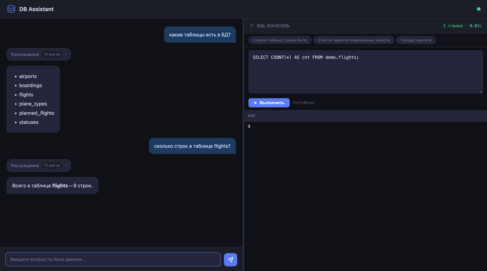

**English** | [Русский](Readme.md)

# DB Assistant — Database Analysis Assistant

**What this demo shows.** A web application that lets you talk to a database in plain natural language. The user asks a question ("how many passengers flew out of Moscow in July?") — the app writes the SQL itself, runs it, and returns the answer. The demo shows how Yandex AI Studio models can be used to build an assistant for analysts, developers, and DBAs without giving them direct access to the database or requiring them to know SQL.

**How it works.** On startup, the application reads the structure of the selected schema — tables, columns, relationships, indexes — and injects it into the system prompt. As a result, the model already "knows" the database and produces correct SQL without asking the user clarifying questions. Three agents work together inside: a parent router agent receives the question and delegates it either to the metadata agent (schema, indexes, statistics, optimization) or to the data agent (SQL generation and execution). All database calls go through an MCP server in read-only mode — data cannot be modified or deleted. The UI is split: the chat with the assistant is on the left, and an SQL console on the right shows in real time which queries the agent built and executed.

Under the hood: the [OpenAI Agents SDK](https://github.com/openai/openai-agents-python) on top of Yandex AI Studio (Handoff pattern between agents) and three microservices orchestrated by Docker Compose.



*Left — the chat with the assistant in natural language; right — the SQL console with preset buttons and the result of the last query. The "Reasoning" block can be expanded to see each step the agent took: which MCP tools were called and in what order.*

## Business value

- **Self-service for non-technical users.** Analysts, product managers, and other business users get answers from the database in plain language — no ticket to a developer, no SQL knowledge required.
- **Faster onboarding to an unfamiliar schema.** A new team member or contractor asks "how are orders modelled here?" and the agent finds the relevant tables, relationships, and describes them.
- **Schema audit and optimization without a DBA.** Checking for missing indexes, stale statistics, the foreign-key dependency tree, or getting a query optimization hint — all directly from the chat.
- **Safe by default.** All database calls are read-only, every generated SQL is visible in the console, and only the schema structure is sent to the model — your data stays in your perimeter.

## What the assistant can do

- Convert natural language questions into SQL queries using the loaded schema context
- Analyze table metadata: columns, types, descriptions, statistics, indexes, foreign keys
- Recommend SQL optimizations based on index structure and table statistics
- Build a foreign key dependency tree to visualize relationships between tables
- Look up database parameter values and return concrete results
- Execute arbitrary read-only SQL queries and display results live in the SQL console

## Example queries

A few common scenarios. The full step-by-step demo script for the `demo` schema (air travel) — from simple lookups to multi-table JOINs and optimization — lives in [`examples/README.md`](examples/README.md).

**SQL from a description**

```
Write a query to get all orders for a user over the last month
```

The agent uses the schema from `AGENT.md` and produces ready-to-run SQL with correct table names and schema qualifiers.

**Table structure and indexes**

```
Show the columns of the orders table
What indexes exist on the account table?
```

**SQL optimization**

```
Help me optimize this query:

SELECT u.id, u.email, COUNT(o.id) AS orders_count
FROM public.users u
JOIN public.orders o ON o.user_id = u.id
GROUP BY u.id, u.email
```

The agent checks indexes on `users.id` and `orders.user_id`, looks at table statistics, and suggests concrete changes.

**Foreign key tree**

```
Show the foreign key dependency tree for the orders table at depth 2
```

**Database parameters**

```
What is the current value of work_mem?
```

## Architecture

```
Browser
  │  WebSocket (Socket.IO v4)
  ▼
agent (Python / FastAPI + uvicorn, port 8083)
  │  OpenAI Agents SDK (Yandex AI Studio / Responses API)
  │
  ├─ AssistantAgent         ← parent agent, receives user requests
  │     │  handoff
  │     ├─ MetadataAgent    ← schema analysis, indexes, FK via MCP tools
  │     └─ DataAgent        ← SQL execution via MCP run_wide_sql
  │
  ▼  SSE (MCP)
mcp_server (Go, port 8081)
  │  HTTP REST
  ▼
metadata_server (Go, port 8080)
  │  SQL
  ▼
Database (PostgreSQL / MySQL / Oracle)
```

Three microservices are orchestrated via Docker Compose inside an isolated `mcp_network`. The web UI is served by the `agent` container (FastAPI + Socket.IO); the SQL console supports manual queries and configurable preset buttons — see the `YANDEX__SQL_PRESETS` setting in the Quick start section.

## Requirements

**Infrastructure**

- Docker and Docker Compose
- Network access from the host/VM to the database
- A Yandex Cloud account with access to AI Studio

**Supported databases**

| Database | `MDATA_TYPE` value |
|----------|--------------------|
| PostgreSQL / Yandex Managed PostgreSQL | `postgres` |
| MySQL / Yandex Managed MySQL | `mysql` |
| Oracle DB | `oracle` |

The service works only with metadata (`pg_catalog`, system catalogs) — no access to table data is required, except for `run_wide_sql` mode (read-only transaction).

**Required privileges**

- **PostgreSQL** — access to `pg_catalog`, `information_schema`
- **MySQL** — access to `information_schema`, `performance_schema`
- **Oracle** — `SELECT` on `all_tables`, `all_tab_columns`, `all_indexes`, `all_ind_columns`, `all_constraints`, `all_cons_columns`, `v$parameter`

## Quick start

> **No database of your own for the demo?** Use the ready-made schema in the `examples/` folder — PostgreSQL, schema `demo` modelling air travel (10 airports, ~38,000 boardings for July 2026). It comes with a curated list of demo questions covering different agent scenarios. Setup instructions and the demo script are in [`examples/README.md`](examples/README.md).

### 1. Clone the repository

```bash
git clone <repo-url>
cd db-assistant
```

### 2. Create `.env` — database connection

Used by `metadata_server` and `mcp_server`.

```env
# metadata_server URL inside the docker-compose network (do not change)
META_URL=http://web:8080

# Database connection parameters
MDATA_HOST=rc1b-xxx.mdb.yandexcloud.net
MDATA_PORT=5432
MDATA_USER=myuser
MDATA_PASS=mypassword
MDATA_TYPE=postgres        # postgres | mysql | oracle
MDATA_BASE=mydb

# MCP server parameters
MCP_PORT=8081
MCP_HOST=mcp               # container name (do not change for docker-compose)
SSE_MODE=true              # true — SSE for agents SDK; false — stdio

# Path to CA certificate (for TLS connections to MySQL only)
# MDATA_CAPATH=/app/root.crt
```

**Parameter reference**

| Parameter | Description | Example |
|-----------|-------------|---------|
| `META_URL` | Internal metadata_server URL | `http://web:8080` |
| `MDATA_HOST` | Database host or FQDN | `rc1b-xxx.mdb.yandexcloud.net` |
| `MDATA_PORT` | Database port | `5432` (PG), `3306` (MySQL), `1521` (Oracle) |
| `MDATA_USER` | Database user | `myuser` |
| `MDATA_PASS` | Password | — |
| `MDATA_TYPE` | Database type | `postgres` / `mysql` / `oracle` |
| `MDATA_BASE` | Database name / SID | `mydb` |
| `MCP_PORT` | MCP server port | `8081` |
| `MCP_HOST` | MCP server hostname in the docker network | `mcp` |
| `SSE_MODE` | MCP mode: SSE (`true`) or stdio (`false`) | `true` |
| `MDATA_CAPATH` | Path to CA certificate inside the container | `/app/root.crt` |

> For Yandex Managed MySQL with TLS: download `root.crt` and place it at `/var/opt/root.crt` on the host — it is already mounted in `docker-compose.yaml`.

### 3. Create `.env.agent` — agent settings

Mounted into the `agent` container as `/app/.env`.

```env
# Yandex Cloud folder ID
YANDEX__FOLDER_ID=b1gxxxxxxxxxxxxxxxxx

# Yandex AI Studio API key
YANDEX__AUTH=AQVN...

# Yandex AI Studio base URL (do not change)
YANDEX__URL=https://ai.api.cloud.yandex.net/v1

# Model — URI in the format gpt://<folder_id>/<model>/latest
YANDEX__MODEL=gpt://b1gxxxxxxxxxxxxxxxxx/yandexgpt/latest

# MCP server URL in the docker-compose network (do not change)
YANDEX__GET_INFO_MCP_URL=http://mcp:8081/sse

# Default database schema — loaded at startup and injected into agent context
YANDEX__METADATA_SCHEMA=public

# Web interface port
YANDEX__PORT=8083

# AI API response timeout (seconds)
YANDEX__WAIT_TIMEOUT=45

# Max agent steps (tool calls + handoffs) per user message
YANDEX__MAX_TURNS=25

# Log file name inside the container
YANDEX__LOG_FILE_NAME=agent_main.log

# System prompts for each agent
YANDEX__ASSISTANT_INSTRUCTION=<system prompt for AssistantAgent>
YANDEX__METADATA_INSTRUCTION=<system prompt for MetadataAgent>
YANDEX__DATA_INSTRUCTION=<system prompt for DataAgent>

# Session history sliding window (number of SDK items sent to the model per turn)
# 0 = no limit; ~5-10 items per visible conversation turn,
# SESSION_MAX_HISTORY=30 ≈ 4-6 past turns retained in context
YANDEX__SESSION_MAX_HISTORY=0

# Enable verbose debug logging (OPENAI_LOG=debug) to container stdout
# Use only for troubleshooting — generates large log volume
YANDEX__DEBUG=false

# Preset SQL queries shown as buttons in the SQL console (JSON array)
YANDEX__SQL_PRESETS=[{"description":"Table list","sql":"SELECT table_name FROM information_schema.tables WHERE table_schema = 'public' ORDER BY table_name"},{"description":"Table sizes","sql":"SELECT relname, pg_size_pretty(pg_total_relation_size(oid)) FROM pg_class WHERE relkind = 'r' ORDER BY pg_total_relation_size(oid) DESC LIMIT 20"}]
```

**Parameter reference**

| Parameter | Default | Description |
|-----------|---------|-------------|
| `YANDEX__FOLDER_ID` | — | Yandex Cloud folder ID (from the Console "Overview" page) |
| `YANDEX__AUTH` | — | API key or IAM token for Yandex AI Studio |
| `YANDEX__URL` | — | Yandex AI Studio endpoint (OpenAI-compatible) |
| `YANDEX__MODEL` | — | Model URI: `gpt://<folder_id>/<model>/latest` |
| `YANDEX__GET_INFO_MCP_URL` | — | SSE endpoint of the MCP server |
| `YANDEX__METADATA_SCHEMA` | `public` | Schema loaded at startup and added to agent context |
| `YANDEX__PORT` | — | Web application port |
| `YANDEX__WAIT_TIMEOUT` | — | AI API response timeout in seconds |
| `YANDEX__MAX_TURNS` | `25` | Max agent steps (tool calls + handoffs) per request |
| `YANDEX__LOG_FILE_NAME` | — | Log file path inside the container |
| `YANDEX__ASSISTANT_INSTRUCTION` | — | System prompt for the parent AssistantAgent |
| `YANDEX__METADATA_INSTRUCTION` | — | System prompt for MetadataAgent |
| `YANDEX__DATA_INSTRUCTION` | — | System prompt for DataAgent |
| `YANDEX__SESSION_MAX_HISTORY` | `0` | Session history window: SDK items in context; `0` = unlimited |
| `YANDEX__DEBUG` | `false` | `true` enables `OPENAI_LOG=debug` and httpx tracing to stdout |
| `YANDEX__SQL_PRESETS` | `[]` | JSON array `[{"description":"...","sql":"..."}]` for SQL console buttons |

> Settings use Pydantic `BaseSettings` with `__` as the nested delimiter — all under the `YANDEX__*` prefix. See `agent/utils/config.py`.

### 4. Build and run

```bash
# Build images
docker-compose build

# Start all services
docker-compose up -d

# Check status
docker-compose ps

# Follow agent logs
docker-compose logs -f agent
```

On startup, `agent` automatically reads the table list from the `YANDEX__METADATA_SCHEMA` schema via MCP and writes the full schema description (columns, indexes, FK relationships) to `AGENT.md`. This file is injected into the system prompt of MetadataAgent and DataAgent — the agents know the schema and write correct SQL without asking the user for clarification.

### 5. Open the web interface

```
http://localhost:8083/
```

### Note: `SESSION_MAX_HISTORY` vs `MAX_TURNS`

Two agent settings that are often confused — they control different things:

| Parameter | Controls |
|-----------|----------|
| `MAX_TURNS` | Number of agent steps (LLM calls + tool calls) allowed within a **single** user message |
| `SESSION_MAX_HISTORY` | Number of SDK items from **past turns** sent to the model as context on each request |

Each visible conversation turn produces roughly 5–10 SDK items (user message, reasoning block, tool call, tool result, assistant reply). With `SESSION_MAX_HISTORY=30`, approximately 4–6 past turns are retained in context.

## MCP tools

| Tool | Agent | Parameters | Description |
|------|-------|------------|-------------|
| `get_metadata` | MetadataAgent | `schemaName`, `tableName` | Columns, types, comments |
| `get_table_list` | MetadataAgent | `schemaName`, `tableName` (wildcard) | List of tables |
| `get_statistics` | MetadataAgent | `schemaName`, `tableName` | Table statistics |
| `get_indexes` | MetadataAgent | `schemaName`, `tableName` | Table indexes |
| `get_db_parameters` | MetadataAgent | `parameterName` | Database parameter value |
| `get_relationships` | MetadataAgent | `schemaName`, `tableName`, `depth` (opt.) | FK dependency tree |
| `run_wide_sql` | DataAgent | `sql` | Read-only SQL query |

## metadata_server REST API

Available on port `8080`. Used automatically by the MCP server; direct calls are useful for debugging.

| Method | Path | Description |
|--------|------|-------------|
| `GET` | `/healthz` | Health check |
| `POST` | `/connection/open` | Open connection (form: `dbtype`, `dbhost`, `dbport`, `username`, `password`, `database`, `capath`) |
| `POST` | `/connection/close` | Close connection |
| `GET` | `/connection/status` | Connection status |
| `GET` | `/metadata/{schema}/{table}` | Table metadata (columns, types, descriptions) |
| `GET` | `/tables/{schema}/{table}` | Table list by wildcard (`%`, `_` supported) |
| `GET` | `/stats/{schema}/{table}` | Table statistics (row count, analyze date) |
| `GET` | `/indexes/{schema}/{table}` | Table indexes |
| `GET` | `/parameter/{name}` | Database parameter value |
| `GET` | `/relationships/{schema}/{table}?depth=N` | FK dependency tree (depth 1–5, default 5) |
| `POST` | `/sql` | Execute SQL in read-only mode (form: `sql`) |

## Yandex Cloud services used

- **Yandex AI Studio** — YandexGPT models, Responses API (OpenAI-compatible)
- **Yandex Managed Service for PostgreSQL / MySQL** — target databases (optional)
- **Yandex Cloud Compute** — VM for running docker-compose (optional)
